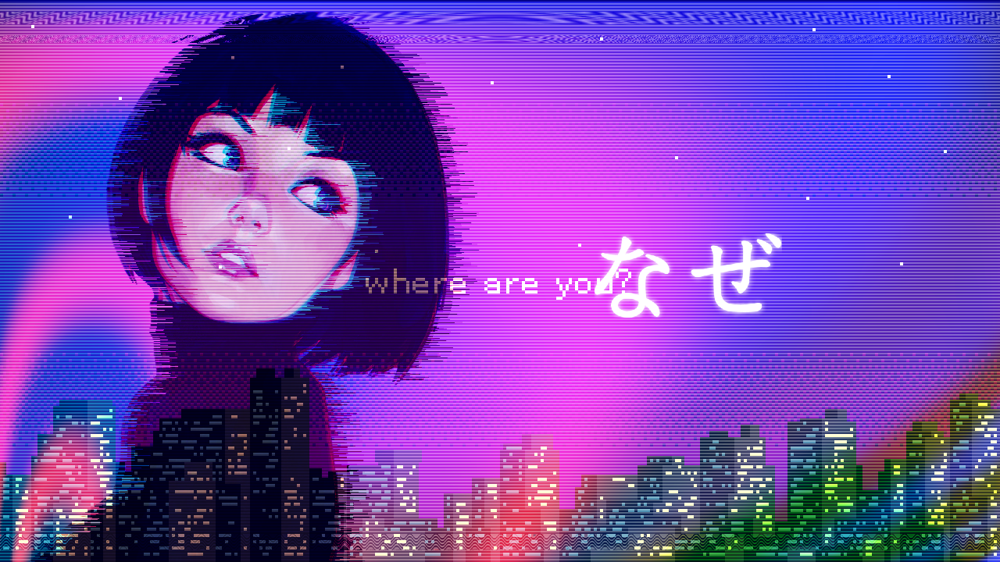
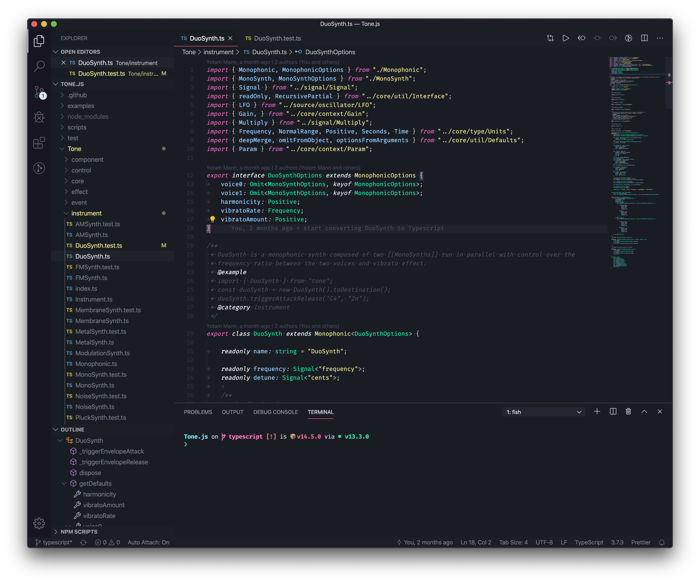
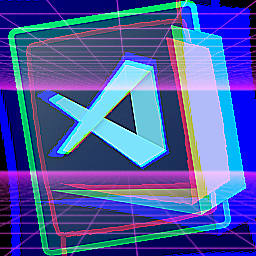

# ＡＥＳＴＨＥＴＩＣＳ

  

---

  

## ( ⧉ ⦣ ⧉ )

  

## Installation

1. Open the **Extensions** sidebar in VS Code
2. Search for `Vaporwave Theme`
3. Click **Install**
4. Open the **Command Palette** with `Ctrl+Shift+P` or `⇧⌘P`
5. Select **Preferences: Color Theme** and choose Vaporwave.

> This theme is heavily inspired by [Horizon](https://github.com/jolaleye/horizon-theme-vscode) and [Synthwave](https://github.com/robb0wen/synthwave-vscode) !

## License

[MIT](LICENSE) © [Filipe Herculano](https://github.com/this-fifo)
